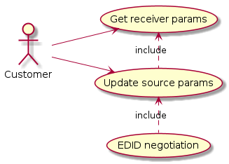
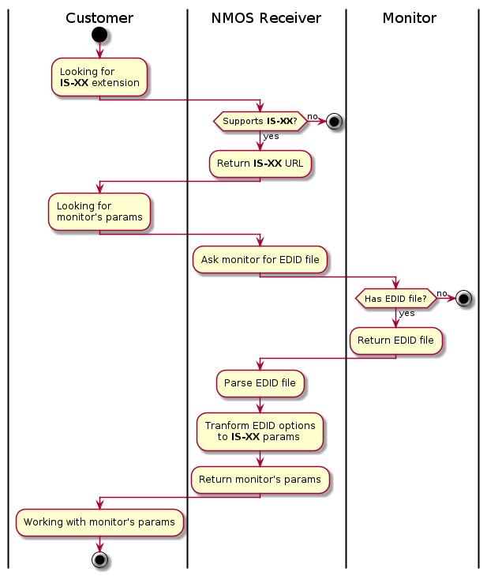
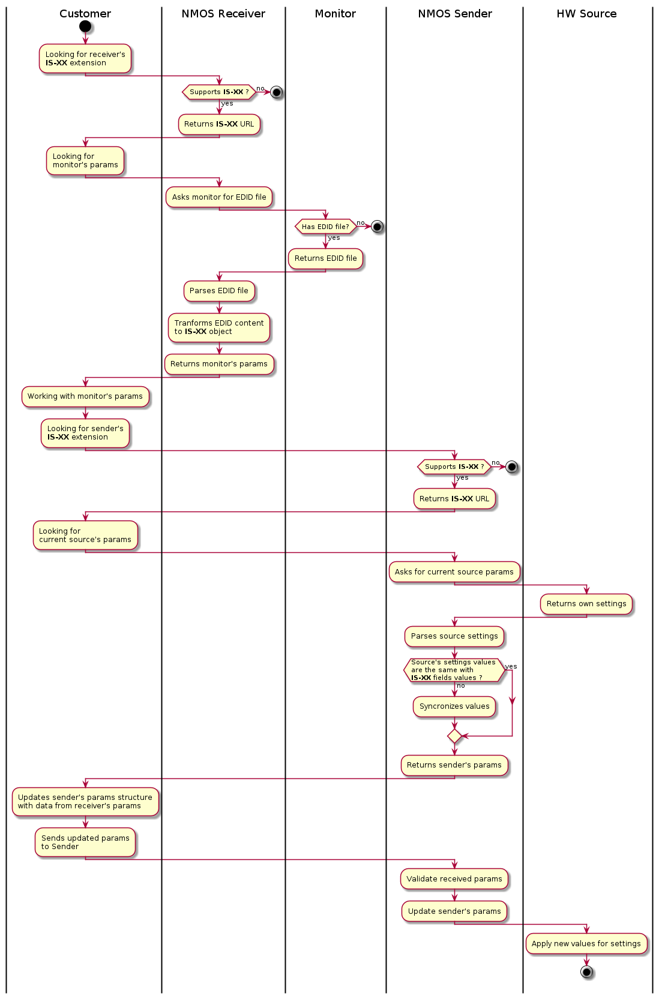
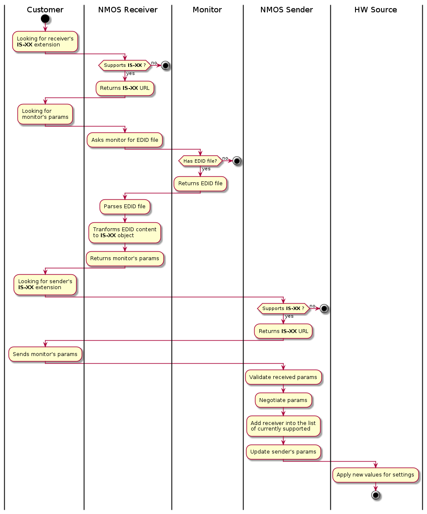
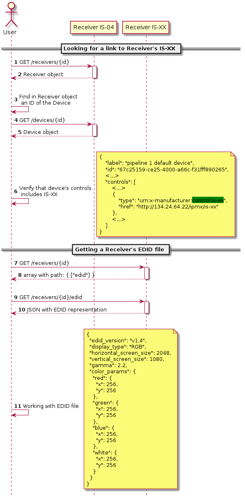
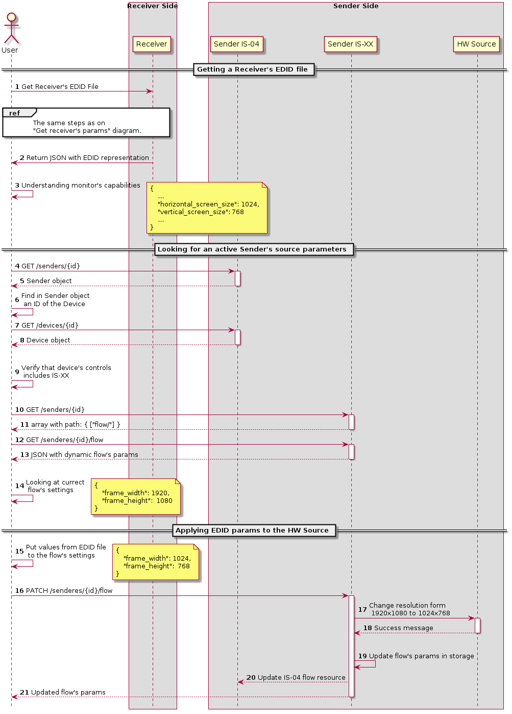
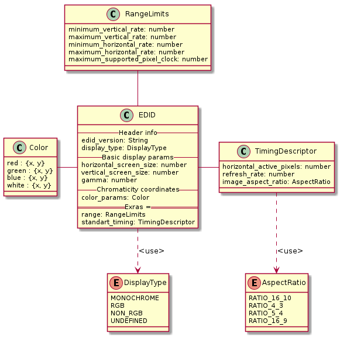

# IS-XX: EDID

Regular **Markdown** here.

## Diagrams

First of all, we need to define use-cases that we are trying to cover with the proposed solution:

For each Use Case we have an activity diagram that represents what should happen in order to fullfill the use case.

For get receiver params use-case:

For manual update sender's params use case:

For EDID Negotiation Use case:

We are going to add more details with sequence diagram which extends each activity:

For get receiver params use-case:

For manual update sender's params use case:

For EDID Negotiation Use case:

Also we need to explain the data model that is used in our solution.

Some more markdown

ToDo:
1) edid file -> monitor profile
2) think about source capabilities?
    can we add new resource and ask users to manually define source caps
