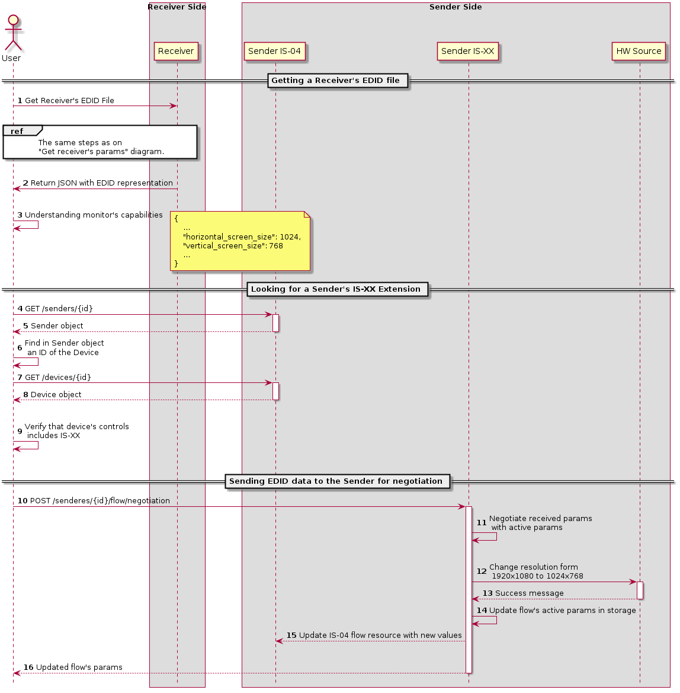

# IS-XX: Monitor Profiles and Interoperable EDID for...

July 7, 2020
## confidential draft

## Introduction

This is a proposal for supporting automatic connection negotiation and re-connection, similar to the behavior provided by EDID / Display ID that is found in consumer monitors, but adapted for the AVoIP.

## Rendering and Previewing the Documents

This repository contains diagrams and documentation for this proposal, using plaintext markup language, which is resilient to bit-rot and viewable by regular humans, even without additional software.

To render the output in Microsoft Visual Code, we recommend the following plugins, to provide automated rendering and preview:

* [API Blueprint Viewer](https://marketplace.visualstudio.com/items?itemName=develiteio.api-blueprint-viewer) - when looking at IS-XX.apib file in your editor, press Ctrl+Shift+P, type there "API Blu" and select "API Blueprint: Live Preview"

**NOTE**: Mac OS does not work with Version 0.9.3. Downgrade to 0.9.2 for happiness and prosperity.

* [PlantUML](https://marketplace.visualstudio.com/items?itemName=jebbs.plantuml) - Right Click on the opened PlantUML file in your editor -> Preview Current Diagram (Alt+D)
* [Markdown Preview Enhanced](https://shd101wyy.github.io/markdown-preview-enhanced/#/vscode-installation) - For previewing markdown (this) documents, including diagrams.

## Problem Statement

Every consumer monitor with HDMI supports a method for communicating its capabilities to any sending device that it is connected to. The [Extended Display ID or EDID](https://en.wikipedia.org/wiki/Extended_Display_Identification_Data) metadata structure is delivered over the HDMI connections [Display Data Channel (DDC)](https://en.wikipedia.org/wiki/Display_Data_Channel) when a  [Hot Plug Detect (HPD)](https://www.datapro.net/techinfo/hot_plug_detection.html) event occurs.

Together, along with the [HDMI and AV Infoframes](https://etmriwi.home.xs4all.nl/forum/hdmi.pdf) sent from the source device, HDMI source and sink are able to start sending the best quality video, accounting for the limitations of each device.

For an introduction to EDID these two resources are helpful:

* [Extron's Understanding EDID](https://www.extron.com/article/uedid)
* [Analog Way's Understanding EDID: An Introduction to AW EDID Editor](http://www.analogway.com/files/uploads/white-papers/white-paper-edid--082714.pdf)

### IP and Multicast Make it Hard

These technologies were designed exclusively for a 1:1 relationship, where one source connects to one device. Later, HDMI switching and extension was added, but these limitations remain. Nothing in the EDID or HDMI specification provides for multiple monitors (sinks) or negotiations over IP.

Further complicating matters are the many sloppy EDID implementations of monitor manufacturers, proprietary extensions and the *slightly* mismatched capabilities of devices that *should* be identical.

Today, the state of the art in the professional audiovisual industry (Pro AV) is complicated and solutions to common problems are proprietary, depending on the vendor's tools for overcoming the "impedance mismatch" between what EDID was designed for and how it is pressed into service.

## Proposed Solution

In IPMX, we have the powerful [NMOS micro service API](http://amwa-tv.github.io/nmos/), which started life in the broadcast industry. While broadcasters do not typically use EDID, the NMOS API has mechanisms we can use to extend it and add control. Our goal is not to duplicate EDID's functionality, but to provide extendable, interoperable connection management mechanisms that are designed for unicast and multicast AV over IP, while supporting the functionality provided by HPD, EDID, and related technologies.

* [IS0-04](https://amwa-tv.github.io/nmos-discovery-registration/tags/v1.3/APIs/NodeAPI.html) will return global info about a receiver. We can add parameters to this endpoint to communicate a monitor's capabilities.
* An NMOS device may register any number of [Device Control Types](https://amwa-tv.github.io/nmos-parameter-registers/branches/master/device-control-types/), which we will use to introduce a new control mechanism called a *Presentation*, which will serve as the resource responsible for responding to HPD events and changes to the monitor capabilities of connected receivers.

## Use Cases

First, we will define use cases that cover the most common scenarios encountered. For each Use Case we have an activity diagram that represents what should happen in order to fulfill the use case.

### Receiver Parameters

In the following activity diagram, we can see the process for getting parameters.

For manual update sender's params use case:

For EDID Negotiation Use case:

We are going to add more details with sequence diagram which extends each activity:

For get receiver params use-case:

For manual update sender's params use case:

For EDID Negotiation Use case:

Also we need to explain the data model that is used in our solution.

Some more markdown

ToDo:
1) edid file -> monitor profile
2) think about source capabilities?
    can we add new resource and ask users to manually define source caps
